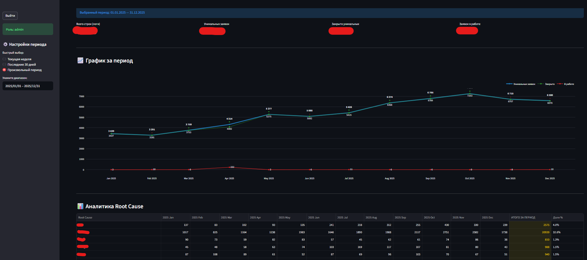

Analytics Report Dashboard
A high-performance analytical dashboard designed for monitoring and classifying L2 technical support tickets. This application connects to an Oracle Database, applies custom Root Cause mapping rules, and provides real-time visualization of support trends.

🌟 Key Features
Role-Based Access Control (RBAC): Secure login system with distinct permissions for admin and user roles.
Automated Root Cause Analysis: Dynamic classification of tickets (e.g., Nexign, MNP, IMEI, Superapp) using custom mapping logic.
Advanced Visualizations: Interactive Plotly charts showing ticket volume trends, closure rates, and period-over-period growth indicators.
Memory-Aware Caching: Integrated psutil monitoring to prevent Out-Of-Memory (OOM) errors by clearing the Streamlit cache when RAM usage exceeds 90%.
Professional Reporting: One-click generation of formatted Excel reports (Analytics + Raw Data) using xlsxwriter.
Dockerized Deployment: Fully containerized environment for consistent deployment across different servers.

🏗 Project Structure
Plaintext
IT-ticket/
├── main.py              # Main Streamlit UI and application logic
├── database_module.py   # Oracle DB connection and SQL execution logic
├── mapping_rules.py     # Root cause classification dictionary
├── requirements.txt     # Python dependencies
├── Dockerfile           # Docker image build instructions
├── docker-compose.yml   # Multi-container orchestration
├── .env                 # Secret environment variables (DB credentials, Passwords)
└── .gitignore           # Git exclusion rules
🛠 Tech Stack
Frontend: Streamlit

Database: Oracle DB (via oracledb library)
Data Processing: Pandas, NumPy
Charts: Plotly (Scatter, Lines, Markers)
Infrastructure: Docker, Docker Compose

🔧 Installation & Setup
1. Environment Configuration
Create a .env file in the root directory and fill in your credentials:

Фрагмент кода
DB_USER=your_db_username
DB_PASS=your_db_password
DB_HOST=your_db_host
DB_PORT=1521
DB_SERVICE=your_service_name
ADMIN_PWD=dashboard_admin_password
USER_PWD=dashboard_user_password
2. Running with Docker (Recommended)
Build and start the application in a detached mode:

3. Add your SELECT on database_module.py 

Bash
docker-compose up -d --build
The app will be accessible at http://your-server-ip:8501.

4. Manual Local Installation
If you prefer to run it without Docker:

Install the required packages:

Bash
pip install -r requirements.txt
Launch the application:

Bash
streamlit run main.py

🔐 Security & Optimization
Database Safety: Connection strings are built dynamically using environment variables to avoid hardcoded credentials.

Lightweight Image: The Dockerfile utilizes python:3.10-slim to reduce the attack surface and optimize deployment speed.
Error Handling: Includes comprehensive try-except blocks for database queries and Excel generation.